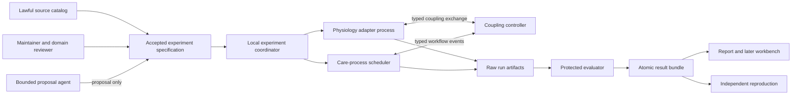

# Vital Rehearsal architecture

Status: **architecture foundation accepted; software-control runner implemented; physiology runtime not admitted**. Owner: Lucas Santana. Foundation date: 2026-09-07. Current local slice: [decision 0001](docs/decisions/0001-launch-and-control-slice.md). Evidence: [STATUS.md](STATUS.md).

## 1. Purpose, context of use and nonclaims

Vital Rehearsal is intended to become a local-first research platform for reproducible studies that combine bounded physiology models with care-process simulations. Its end state can support separate research programmes in heart, lung and liver physiology; disease and immune-response models; aggregate vaccine-response questions; synthetic cohorts; and operational questions about queues, transport, staffing and resource availability.

The first context of use is deliberately narrower: reproduce an exact public, non-patient-specific cardiopulmonary benchmark and document whether the chosen engine reproduces the source-defined observables under source-justified acceptance criteria. A later experiment may pass a supported event from an independently verified care-process scheduler into that physiology adapter. This is research about model behavior and workflow timing. It is not diagnosis, treatment advice, dose selection, surgical planning, a medical device, or evidence of clinical benefit.

The architecture protects five distinctions:

1. software verification is different from agreement with a published benchmark;
2. benchmark agreement is different from model applicability to a new question or population;
3. a synthetic cohort is different from a representative human population;
4. a model prediction is different from empirical or clinical evidence;
5. a reproducible result can still be scientifically wrong.

Patient-specific modeling is outside the declared context of use. The repository accepts only lawfully reusable public aggregate inputs, public models whose terms have been reviewed, and synthetic fixtures generated without patient-level source records. No patient data, protected health information, controlled-access dataset, reidentified or merely de-identified record may cross the intake boundary.

## 2. Architectural principles

### Question before model

Every study begins with a precise question, a declared context of use, and the consequence of a wrong result. Model credibility is assessed for that question; it is never inherited as a universal property of an engine. The required evidence grows with reliance and consequence. A model card therefore binds an adapter version to supported observables, states, populations, time horizon, perturbations and interpretations.

### Independent domains before coupled claims

Cardiovascular, respiratory, hepatic, immune/disease and care-process models have different state spaces, time scales and evidence. Each domain must pass standalone verification and its own benchmark before coupling. A passing heart-lung study cannot validate a hepatic or immune adapter. A workflow queue cannot directly edit physiology state; it emits a typed event that the receiving model may accept, translate or reject.

### Contracts before infrastructure

The first implementation is a standard-library Python command-line coordinator, filesystem result bundles and one process-separated reviewed adapter. Process separation contains ordinary crashes but is not a security sandbox. JSON contracts and CSV tables are sufficient for small metadata and trajectories. SQLite is introduced only when durable concurrent scheduling is required. Larger-array storage, a browser workbench, containers, accelerators and distributed workers each need a measured trigger.

### Negative evidence is a result

A scientifically unfavorable run can be `COMPLETED` while its separate scientific conclusion is `CONTRADICTED` or `INCONCLUSIVE`. Missing outputs, nonconvergence, invalid units, unsupported actions, conservation failure or out-of-domain inputs are invalid execution evidence and must terminate with an explicit run-failure class. No component may silently replace, interpolate or omit failed runs to improve an aggregate result.

## 3. Domain decomposition



### Research control plane

The control plane owns source admission, model cards, experiment acceptance, budgets, run lifecycle, artifact indexing and human review. It does not calculate physiology or decide that a model is clinically valid. Its coordinator is a deterministic state machine over persistent records and subprocess results.

### Physiology domain

The first adapter targets a lumped cardiopulmonary model because the first question concerns coupled heart-lung observables over time. Pulse is a candidate, not an adopted dependency. Its official documentation describes cardiovascular and respiratory systems, explicit model assumptions, validation pages and an Apache-2.0 distribution; exact release artifacts, build compatibility, source evidence and applicable outputs still require VR-001 and VR-002 review.

The physiology adapter owns:

- engine-specific input translation and startup/stabilization;
- time advancement through an explicit adapter method;
- extraction of named observables with canonical units;
- raw engine logs, solver/version settings and exit diagnostics;
- engine checkpoint support only if the selected engine documents it.

It does not own cohort claims, care priorities, acceptance tolerances, report conclusions or clinical interpretation. Heart and lung may be one adapter only when the selected upstream model couples them internally and its benchmark covers the requested outputs. Liver enters as a separate adapter with a declared exchange surface such as blood flow or transported substance quantity; it cannot be inferred from a low-resolution liver compartment merely because that compartment exists.

Cardiac electrophysiology, hemodynamics, gas exchange and tissue mechanics are separate model classes. The FDA cardiac electrophysiology verification problems are useful candidates for future solver code-verification work, but their analytic monodomain/bidomain solutions do not validate a whole-body cardiopulmonary model. Vital Rehearsal must not combine these evidence claims.

### Disease and immune-response domain

Disease and immune-response models are adapters over a model registry, never flags added to the cardiopulmonary state. A candidate must have a citable governing model, public reusable implementation or sufficient specification, a declared organism/population and observable, identifiable or explicitly non-identifiable parameters, and independent confirmation evidence. BioModels and the Physiome Model Repository are discovery catalogs; repository presence or curator labels do not establish suitability.

The vaccine research lane separates three questions:

- within-host immune dynamics, if a lawful mechanistic model and public benchmark exist;
- population coverage or transmission scenarios using public aggregate data;
- care-process capacity under a wholly synthetic demand process.

Outputs from one lane cannot be treated as evidence for another. Aggregate WHO or CDC vaccination coverage can support population-level scenario inputs after version and licensing review; it cannot calibrate individual immune response. This project excludes pathogen sequence design, mutation optimization, pathogen enhancement, wet-lab protocols and actionable biological experimentation.

### Care-process domain

The care-process model is a discrete-event simulator over synthetic entities and abstract resources. Initial primitives are arrivals, queues, service starts/completions, transport delay, resource acquisition/release and typed escalation events. The event scheduler uses integer ticks in a chosen base unit, a monotonic simulation clock and stable ordering by `(event_time, priority_class, insertion_sequence)`.

The care model owns waiting time, queue length, throughput, abandonment policy when explicitly modeled and resource utilization. It does not own physiological state or treatment efficacy. A care event can request one predeclared physiology action only through the coupling controller. Scenario reports should follow the relevant STRESS-DES reporting fields for objectives, inputs, scenario logic, event ordering, warm-up, replications, uncertainty, software and hardware; checklist conformance supports transparent reporting, not scientific validity.

## 4. Numerical contract: time, units, coupling and conservation

### Canonical quantities

Every numeric quantity is a triple: `value`, `unit`, and semantic `quantity_kind`. Unit strings use case-sensitive UCUM codes where an applicable code exists. The schema also records the adapter-native unit and conversion expression. A compatible dimension is necessary but insufficient: pressure measured relative to atmosphere and absolute pressure have the same dimension but different semantics, and a concentration is not interchangeable with a transported amount.

The coordinator rejects:

- missing or unknown units;
- incompatible dimensions;
- ambiguous offsets or reference frames;
- nonfinite values;
- values outside the model card's supported domain;
- conversions without a named, tested mapping.

The initial implementation may support a small reviewed subset of UCUM without adding a units dependency. Full UCUM conformance requires semantic equivalence, so the system must not claim it from string validation alone.

### Time model

The coordinator uses integer nanoseconds or another declared integer tick for orchestration timestamps. Each adapter declares:

- native solver time unit and numeric representation;
- minimum/maximum step and whether the step is fixed or adaptive;
- valid communication points and event-discontinuity behavior;
- interpolation policy, if any, for reported observations;
- whether rollback/checkpoint is supported;
- stabilization phase and when observations become admissible.

Continuous engines advance from communication point `t_n` to `t_{n+1}`. The coordinator never assumes an event applied at the end of that interval affected the earlier trajectory. Discrete care events at the same tick are ordered deterministically. If an adapter reports an internal event before the requested communication point, the adapter contract must either return early with the event time or reject that coupling mode.

FMI 3 is a later interoperability candidate because it defines model exchange and co-simulation communication points, capability flags, early return and state restore. The first adapter stays a narrow process protocol. FMI is adopted only after two independent engines need those semantics and a compatibility experiment shows that the standard reduces adapter-specific code without hiding unsupported rollback or direct feedthrough.

### Coupling protocol

At each coupling boundary:

1. the coordinator snapshots the last accepted states and proposed event;
2. the source adapter emits only versioned outputs declared in its model card;
3. the coupling controller validates timestamp, quantity kind, unit, provenance and target capability;
4. the target adapter applies the event at a supported communication point;
5. both adapters advance to the next barrier;
6. the evaluator checks exchange and conservation residuals before the state is accepted.

The initial coupling is one-way: care-process delay selects the time of a predeclared, benchmark-supported scenario input. Bidirectional feedback is prohibited until a benchmark exercises the feedback loop and the coordinator can detect convergence failure or oscillation. No LLM may create a conversion, map free text to an action during a run or edit solver state.

### Conservation ledger

Each adapter declares conserved or balanced quantities applicable to its model: fluid volume, transported mass/amount, charge or energy where represented. For quantity `q` over a coupling interval, the evaluator records:

`residual(q) = closing(q) - opening(q) - admitted_sources(q) + admitted_sinks(q)`

Every source, sink and boundary exchange must have a typed cause and unit. Tolerance is a model-specific sum of numerical error, source precision and declared discretization error; it is never a project-wide magic number. If the model intentionally omits a balance, its model card says so and dependent claims cannot rely on conservation of that quantity. A residual above the predeclared tolerance produces `INVALID_CONSERVATION`, not a warning.

## 5. Model cards, applicability and uncertainty

Each `ModelCard` binds one immutable adapter release to:

- equations/model family and upstream citation;
- state variables, parameters, outputs, units and reference frames;
- context of use and prohibited interpretations;
- organism, demographic/physiological envelope and initialization assumptions;
- spatial resolution, time horizon and supported perturbations;
- calibration sources and excluded confirmation sources;
- software/code verification evidence;
- benchmark/model validation evidence;
- sensitivity, identifiability and uncertainty evidence;
- known failures, missing mechanisms and invalid-state criteria;
- license, redistribution terms, environment and source revision;
- reviewer decisions with scope and date.

Applicability is evaluated per experiment. `SUPPORTED` means every requested input, state transition, observable and time horizon fits the model card and the context-of-use reviewer accepted the mapping. `PARTIAL` means a named extrapolation or missing mechanism exists and the result cannot pass a confirmatory gate. `UNSUPPORTED` prevents execution. Applicability is not a scalar confidence score.

Uncertainty is kept in separate channels:

- input uncertainty from aggregate/source estimates;
- parameter uncertainty and correlation;
- numerical error and solver convergence;
- structural/model-form uncertainty;
- stochastic variation in cohorts and queues;
- between-source disagreement;
- applicability uncertainty when transferring context.

Reports show which channels were quantified, bounded qualitatively or not assessed. Sensitivity analysis does not repair non-identifiability. Parameters calibrated on development evidence are frozen before confirmation. Access to confirmation cases is logged and bounded; repeated tuning reclassifies them as development evidence.

## 6. Source, provenance and lawful-input boundary

### Admission stages

1. **Discovery:** record a candidate URL and why it may answer the question; do not download or execute it.
2. **Rights review:** identify publisher, exact version/date, license or terms, access conditions, attribution, transformation and redistribution permissions.
3. **Scientific review:** map population, variables, collection/measurement method, uncertainty, missingness and limitations to the context of use.
4. **Technical intake:** fetch through an explicit command, record transport metadata, validate type/size/schema, and store only allowed bytes.
5. **Derivation:** record every transformation, input version, tool version and output relation.
6. **Release review:** include or link only artifacts whose redistribution terms permit it.

Publicly reachable does not mean lawfully reusable. A paper does not automatically license supplementary code or data. A derived aggregate is not automatically free of source restrictions. A synthetic dataset created from patient data remains out of scope because the patient-level source would cross the project boundary.

`SourceRecord` uses a lightweight W3C PROV-inspired entity/activity/agent relation: who published the input, which activity transformed it, which artifact it generated and what it derived from. Full RDF/PROV-O storage is deferred until cross-system interchange creates a concrete need.

The source catalog stores metadata and permitted local references. It never stores API keys, authentication cookies, controlled-access tokens, private medical data or opaque serialized code. Remote model archives are treated as untrusted. Intake denies archive traversal, executable hooks, native libraries and unsafe deserialization unless an explicitly reviewed adapter task authorizes an isolated build.

## 7. Experiment and result contracts

### ExperimentSpec

An accepted specification is immutable and schema-versioned. It contains:

- human-readable question and context of use;
- baseline and candidate arms, paired-input policy and causal nonclaims;
- model cards, source records and exact scenario revisions;
- initial/boundary conditions and synthetic cohort generator contract;
- requested observables, quantity kinds, units and sampling schedule;
- solver, coupling and stabilization settings;
- seeds and stochastic replication plan;
- calibration and confirmation partition;
- metrics, direction, acceptance criteria, invalid states and falsifier;
- compute, memory, disk, wall-time, network and attempt ceilings;
- allowed adapters and requested output artifacts;
- reviewer/maintainer acceptance needed for the stated claim.

Unknown execution fields fail closed. Changes create a new specification revision. An agent may draft a spec but cannot accept it.

### RunResult

One logical run has immutable attempt records and exactly one accepted terminal result. The result contains:

- spec and attempt IDs;
- source revision and dirty-state declaration;
- adapter/engine/environment versions and invocation arguments;
- hardware, operating system, locale, thread count and floating-point mode where available;
- actual seeds, steps, communication points and resource consumption;
- raw outputs, diagnostics, conservation ledger and evaluator findings;
- uncertainty outputs and applicability decision;
- terminal state and failure reason;
- artifact manifest using ordinary paths, sizes and media types;
- reproduction instructions.

Artifact digests may be used later for intrinsic bundle integrity, but never as a substitute for scientific review or plan approval. An integrity match establishes identical bytes, not equivalent behavior or valid interpretation.

### ResearchClaim

A claim links its exact wording to source facts, model assumptions, run outputs, contradicting evidence, applicability, uncertainty, reproduction state and human reviewer decision. Claim states are `PROPOSED`, `SUPPORTED_WITHIN_MODEL`, `INCONCLUSIVE`, `CONTRADICTED`, `RETRACTED` and `REVIEW_REQUIRED`. The platform has no state meaning “clinically proven.”

## 8. Producer, evaluator and agent separation

The proposal/producer lane may search an admitted source index, draft hypotheses, choose among allowed parameters and request experiments within a fixed budget. It cannot:

- modify model cards, accepted specs, evaluators or confirmation data;
- see hidden confirmation outputs during candidate search;
- increase resource budgets or enable network access;
- suppress attempts, diagnostics or negative results;
- accept a claim, publish a report or change safety policy.

The numerical evaluator is deterministic code with versioned metrics and invalidity rules. A separate reproducibility evaluator rebuilds or reruns a retained bundle. An LLM may explain evaluator output but its explanation is a proposed interpretation and is never the score. High-consequence scientific interpretation requires a qualified human reviewer who did not author the claim when practical.

Evaluator code and confirmation fixtures reside outside adapter-owned paths. Evaluation runs use read-only inputs and write a new result; they never mutate the candidate bundle. Changing a metric or tolerance creates a new evaluation contract and invalidates only evidence that depends on the old contract.

## 9. Lifecycle, failure semantics and recovery

### State machine

`DRAFT -> ACCEPTED -> QUEUED -> CLAIMED -> RUNNING -> EVALUATING -> COMPLETED -> REPRODUCED`

Alternative terminal states are:

- `REJECTED_POLICY`: rights, privacy, safety, context or capability violation;
- `INVALID_INPUT`: schema, unit, range or provenance failure;
- `INVALID_MODEL`: stabilization, conservation, physiological-domain or applicability failure;
- `FAILED_NUMERICAL`: nonconvergence, nonfinite result or solver error;
- `FAILED_SYSTEM`: process crash, resource exhaustion, storage or infrastructure error;
- `CANCELLED`: explicit cancellation with reason and actor;
- `TIMED_OUT`: wall-time ceiling reached.

Run execution state and scientific conclusion are orthogonal. A `COMPLETED` run may support, contradict or leave a research claim inconclusive; that conclusion is recorded on `ResearchClaim`, never as a run terminal state. Invalid and failed runs do not enter scientific outcome aggregates except as declared failure rates and resource costs. Retrying creates a new attempt under the same logical run only when the specification and inputs are unchanged. A completed terminal result is never overwritten.

### Atomic publication

A worker writes to a run-specific staging directory. It appends logs and checkpoints, then writes a terminal attempt record. The coordinator validates required artifacts and moves the staged bundle atomically into the completed store on the same filesystem. Incomplete staging remains quarantined and visible for recovery; report code ignores it by default.

On restart, the coordinator reconciles every `CLAIMED`, `RUNNING` or `EVALUATING` record against the process table and lease time. An orphan becomes a recoverable failed attempt; it is not silently requeued. Resource accounting includes partial and failed attempts. Cancellation sends a graceful signal, waits a bounded interval, terminates the subprocess tree, records what was produced and releases the worker claim exactly once.

## 10. Local-first implementation and scale triggers

### Foundation topology

```text
contracts/              JSON schemas and human-readable examples
catalog/                reviewed source and model-card metadata
src/vital_rehearsal/    standard-library coordinator and validation
adapters/               one process boundary per admitted engine/domain
scenarios/              public-reference metadata and synthetic fixtures
benchmarks/             development/confirmation partitions and evaluators
runs/                   ignored local staging and completed bundles
reports/                generated research reports
tests/                  contract, known-answer, failure and recovery tests
tools/                  repository and plan validation utilities
docs/                   benchmark, data, decisions and reviews
```

These describe the full planned boundaries. The current source implements only `src/vital_rehearsal/`, a fixed software-control scenario, report/evidence retention, packaging and tests. No scientific adapter, care scheduler or cohort is implemented.

### Initial process protocol

The coordinator invokes adapters with argument arrays, a read-only accepted spec, an empty bounded output directory and a scrubbed environment. The adapter writes newline-delimited diagnostic events and a final JSON result. Standard output is protocol data; standard error is retained diagnostics. The coordinator validates every message and treats protocol drift as failure.

A subprocess boundary, scrubbed environment and declared “no network” policy are hygiene controls, not sandbox enforcement. Until an OS, container or VM boundary demonstrably constrains filesystem paths, credentials, devices, subprocesses, network egress and CPU/memory/disk/wall time, execution is limited to reviewed built-in adapters and non-protected development fixtures. Untrusted third-party adapters, agent-generated code and protected confirmation artifacts must not execute or mount in that environment.

Before admitting untrusted execution, a representative adversarial probe must demonstrate that the enforced boundary blocks reads outside allowlisted inputs, writes outside scratch/output, credential discovery, device access, network egress, subprocess escape and resource-limit evasion. Failure to establish one of those controls is `REJECTED_POLICY`; descriptive instructions or application-level checks cannot substitute for enforcement.

### Scaling sequence and triggers

| Capability | Introduce only when | Required evidence before adoption |
| --- | --- | --- |
| SQLite run index | restart recovery or concurrent local claims cannot be made safe with atomic directories | migration/recovery test, single-terminal-result invariant, backup/export path |
| Columnar or chunked arrays | representative trajectories make CSV parsing or storage a measured bottleneck | benchmark size, read/write profile, interoperability and archival review |
| Local process pool | one adapter is reproducible and sequential campaign time blocks useful work | deterministic claim/lease behavior, CPU/memory limits, cancellation and oversubscription test |
| GPU adapter | an admitted model requires it and CPU completion misses an approved research envelope | exact hardware/runtime matrix, fallback, deterministic settings and resource accounting |
| Remote worker | approved campaigns exceed one workstation after local concurrency is saturated | authenticated scoped work, isolated runtime, resumable upload, duplicate prevention and failure injection |
| Object storage | validated bundles exceed local capacity or multi-machine retrieval is required | retention, encryption, access isolation, incomplete-upload recovery and export/delete policy |
| Queue service | SQLite claims and one coordinator no longer meet measured throughput/recovery needs | idempotent dispatch, expiring claims, poison-job handling, backpressure and cost ceiling |
| Browser workbench | CLI reports reproduce the benchmark and researchers need comparison/navigation | keyboard path, accessible charts/tables, invalid-state visibility and no authority inflation |

No Kubernetes, microservice split, workflow platform, vector database or model-provider dependency belongs in the initial system. A future service boundary is justified by an independently scaling workload, security boundary or availability requirement, not by domain nouns. Shared contracts may be extracted across the related Tanduna projects only after at least two implemented consumers reveal a stable common shape.

## 11. Security and trust boundaries

Trust zones are:

1. **maintainer control:** policy, accepted specs, reviewer decisions and release authority;
2. **reviewed repository:** versioned source and evaluation logic, still untrusted until reviewed and tested;
3. **admitted inputs:** data/model bytes with recorded rights and provenance, never executable authority;
4. **enforced isolated execution (future gate):** untrusted adapter and model behavior only after OS/container/VM containment passes its acceptance probes;
5. **result quarantine:** staged outputs requiring schema, integrity and policy validation;
6. **published local evidence:** accepted bundles, still limited to their context of use.

Application controls include path canonicalization, archive size/file-count limits, no shell interpolation, strict schemas, allowlisted adapters, safe parsers, dependency/source review, append-only attempts and separation of evaluator metadata. They reduce mistakes but do not contain hostile code.

Untrusted adapters, model executables, agent-generated code and protected confirmation require an enforced OS/container/VM execution boundary with read-only allowlisted inputs; a fresh bounded scratch/output mount; no personal or release credentials; no host-device access; denied network egress by default; process-tree containment; and enforced CPU, memory, disk, subprocess and wall-time limits. Protected evaluator code and confirmation fixtures are mounted read-only only for the evaluation phase and are never exposed to the producer. Boundary enforcement and escape/resource probes are acceptance evidence, not future operational suggestions.

The hosted future must never receive personal runner credentials, unrestricted filesystem access, browser cookies, SSH keys, clinical-system credentials or patient data. External execution, cloud resources, datasets with access agreements and any publication remain human-approved actions.

## 12. Reproducibility and evidence promotion

Reproduction has layers:

1. **contract replay:** schema, inputs and expected artifact set can be parsed;
2. **same-environment repeat:** fixed engine/environment and seeds reproduce within declared numerical equivalence;
3. **fresh-checkout reproduction:** documented commands regenerate the bundle from source;
4. **cross-machine reproduction:** a supported environment reproduces observables and failure behavior;
5. **independent implementation or source confirmation:** evidence not authored by the adapter producer agrees within justified criteria;
6. **domain validation:** a qualified reviewer accepts the model/context mapping and limitations.

Bitwise equality is required only where the component promises it. Floating-point trajectories use declared per-observable comparison rules, convergence evidence and conservation checks. Stochastic studies compare distributions or paired outcomes with a predeclared analysis. Environment capture must be sufficient to explain differences but must not include secrets or personal host data.

SED-ML and COMBINE/OMEX are candidates for portable biological simulation descriptions and bundles; CellML or SBML may preserve upstream model forms. The internal first version uses a smaller JSON contract so unsupported standard features cannot be accepted accidentally. Export to a standard becomes a separate validated adapter and must round-trip the supported subset.

## 13. Decisions, rejected alternatives and replan triggers

### Decisions in this foundation

- Start with one exact public cardiopulmonary benchmark and fixed synthetic/reference inputs before cohorts or workflow coupling.
- Use a local coordinator and subprocess adapter boundary; keep numerical engines out of the control process.
- Make units, time, reference frames, conservation residuals and applicability executable contracts.
- Keep physiology, workflow, disease/immunity and hepatic research as separately admitted domains.
- Preserve evaluators, confirmation cases and human acceptance outside producer/agent authority.
- Retain failed, negative and inconclusive attempts with explicit semantics and resource costs.
- Scale only from measured pressure and after recovery/idempotency evidence.

### Alternatives rejected for the initial foundation

- **A bespoke whole-body simulator:** rejected because it would require extensive scientific validation before answering even the first question.
- **Immediate microservices and distributed orchestration:** rejected because no workload, availability target or ownership boundary currently justifies their failure modes.
- **Direct in-process C/C++ bindings:** rejected initially because ABI crashes, dependency conflicts and memory safety failures would share the coordinator's failure domain; revisit only if measured process overhead is material.
- **FMI as the first internal protocol:** deferred because it adds a broad standard surface before two engines need co-simulation; preserve a migration seam instead.
- **One universal organ state graph:** rejected because similarly named quantities across models do not share resolution, semantics or validation.
- **Agent-authored metrics or adaptive holdouts:** rejected because the optimizer would control the evidence used to judge it.
- **Patient-derived synthetic data:** rejected because source patient records would violate the stated intake boundary and synthetic generation does not by itself eliminate privacy risk.
- **Clinical workflow advice as an output:** rejected because the platform's current evidence can compare declared simulations only.

### Replan triggers

Reopen the affected architecture when: the selected benchmark cannot be reproduced without undocumented tuning; required source rights are incompatible; the candidate engine lacks a stable programmatic output or required observable; conservation cannot be defined for a proposed coupling; the context of use expands toward patient-specific or clinical decisions; a second adapter exposes incompatible time semantics; a qualified reviewer rejects applicability; local campaigns exceed approved resource envelopes; or cross-machine reproduction fails for a systematic reason.

If domain review is unavailable, continue contract, solver-verification and published benchmark reproduction only. Cut the workbench, distributed execution, additional organs and agent search before weakening the benchmark, provenance, failure or interpretation gates.

## 14. Current claim boundary

This repository has a reasoned architecture, a dependency graph, an executable plan-consistency validator and an independent software-control CLI. Its producer, evaluator and atomic bundle writer exercise strict inputs, per-observable comparison, nonconvergence/failure retention and recovery without a physiological model. Exact source/build fingerprints bind the frozen input and evaluator records. Decimal comparison prevents input underflow or rounding from producing false agreement. Regular-file descriptor reads reject symlinks, devices and FIFOs before parsing.

There is no admitted physiology engine, care-process simulator, selected executable scientific benchmark, clinical/domain validation, independent human reproduction or public 0.1 release. Candidate standards and engines in [SOURCES.md](SOURCES.md) remain decision inputs. Original task acceptance is preserved; the independent slice is authorized by [decision 0001](docs/decisions/0001-launch-and-control-slice.md), not by rewriting the original graph.

## September 8 v1.0 bounded implementation

The current executable adds `research` commands while retaining legacy controls. Built-ins are the exact unchanged Ben-Tal combination exposure and original synthetic FCFS scheduler. The adapter translates no new physiology: it invokes the retained source equations with pinned SciPy algorithms. VODE reference comparison shares equations; independent semantic checks and solver-envelope analysis are separate studies. Source-derived event semantics do not support clinical coupling, so no model connection exists. Schema, resource, recovery, rights and supported-environment contracts are in docs/v1/CONTRACT.md and FIRST_RUN.md. Historical broader gates remain preserved.
