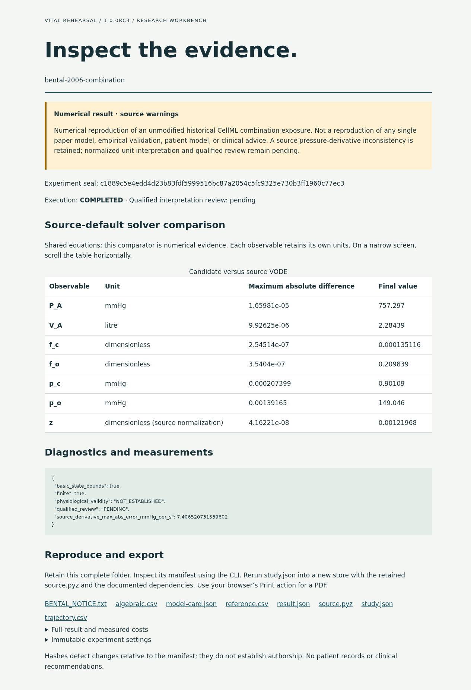
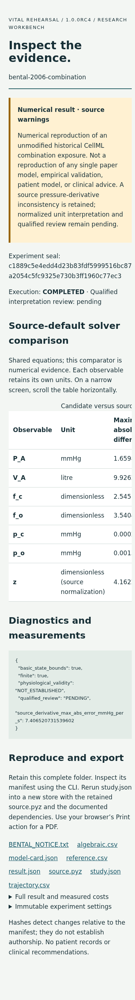
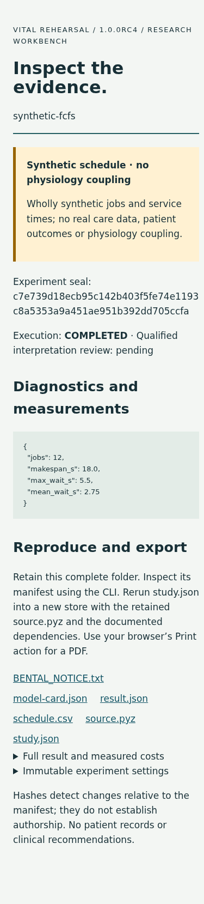

# Observed product verification

The actual packaged rc4 application completed 29 fresh-venv operations in 28.777 seconds. The environment was scrubbed and Python used isolated imports; dependency installation used only supplied hash-locked wheels. Same Linux host, no container, separate machine, external person or credentialed service. See [exact command ledger](../evidence/v1/packaged-runtime/commands.json) and [summary](../evidence/v1/packaged-runtime/verification.json).

## Tested workflow

1. Inspect model applicability and defaults, create/edit/seal and validate a study: passed. A tampered seal was rejected before creating an attempt.
2. Run the actual respiratory source and compare reference/diagnostics: passed with the source discrepancy visible. Numerical VODE failure retained stderr and a failed result; successful process status did not erase the source warning.
3. Run synthetic scheduling: passed with independently checkable waiting/makespan metrics and no coupling.
4. Inspect/export/reopen evidence: passed. Exported bundle verified after extraction; modified trajectory was rejected.
5. Timeout, graceful cancellation and hard interruption: passed. Hard interruption remained unfinalized; the bounded worker completed independently. Recovery produced new complete attempts while original files remained byte-identical.
6. Rerun the source archive in the clean environment: trajectory bytes matched the initial packaged result exactly.

## Report usability and accessibility evidence

Both [respiratory](../../examples/v1/respiratory/report.html) and [scheduling](../../examples/v1/scheduling/report.html) reports were opened in Chromium 140 over local files with external network requests blocked. Browser metadata, focus, semantics, dimensions, native disclosure activation and link checks are recorded in the [respiratory browser log](../evidence/v1/packaged-browser-respiratory/browser-check.json) and [scheduling browser log](../evidence/v1/packaged-browser-scheduling/browser-check.json).

- At 390 and 320 CSS pixels, document reflow had no horizontal overflow. The comparison table uses a labeled, focusable horizontal scroll region with visible instructions; it is not squeezed into unreadable columns.
- At 1280 pixels and 200% CSS zoom, the page remained within the viewport. CSS zoom is not a substitute for every browser/OS magnification mode.
- Tab reached a visible skip-link focus indicator; Enter moved to evidence. Native details opened with a full keyboard Enter event sequence. The first probe omitted the character event and falsely failed; the harness was corrected, not the product control.
- Semantic language/landmark, table row/column headers, text status, zero animation, evidence-file existence and zero external requests were checked. Screenshots were visually inspected for clipped text, missing content, excessive density and contrast risks.

The initial rc1-based report had an unbroken machine status label that overflowed the phone viewport. [The failed screenshot](../evidence/v1/report-check-failed/report-phone-failed.png) and failure data remain retained. Rc4 uses a readable label and wraps long identifiers. Initial browser startup probes also selected an unavailable library path/full-Chrome dependency; using the existing headless Chromium and project-local library directory resolved the harness environment without system installation.

Scope: CLI execution and offline report reading/export. There is no web experiment editor, hosted backend, patient workflow or live deployment. These checks do not establish full WCAG conformance. Manual screen-reader use, human accessibility testing, domain interpretation review and an external person's first run remain pending.

## Build history and preserved failures

The original development-control evidence is preserved. Rc1 investigation source is frozen across all fifty study attempts. Rc2/rc3 were local intermediate builds: rc2's filename did not match its internal rc1 version, and its report still exhibited mobile overflow. Neither is a release artifact. Rc4 is the tested current application. A separate reviewer reran eight selected cases and found no numerical changes from the corresponding rc1 outputs. Same-user artifact separation is convention, not hostile isolation or a signature.
