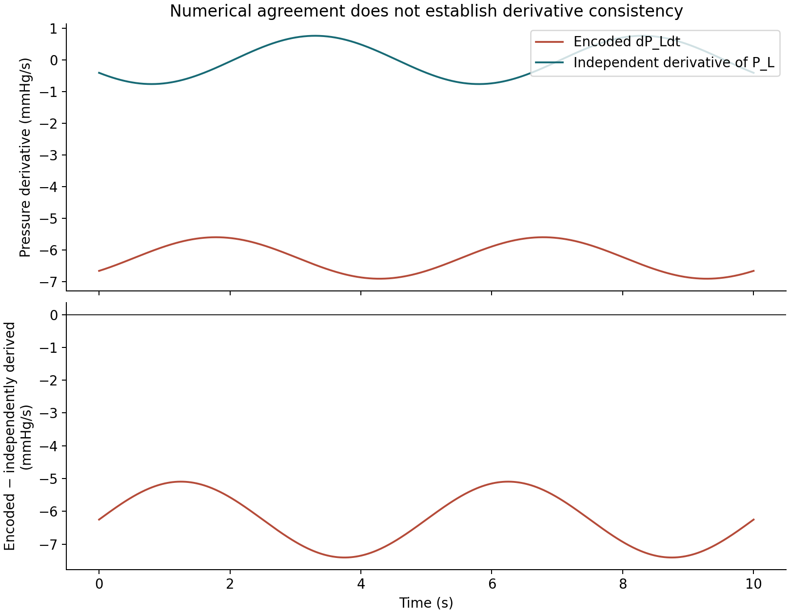

# Solver agreement coexists with an inconsistent pressure derivative in the Ben-Tal 2006 CellML combination exposure

Research draft · 8 September 2026 · GPT-6 Astra investigator · Qualified human interpretation and external reproduction pending

**Plain claim.** This exact software exposure is numerically reproducible within the frozen engineering tolerances over its 10-second default trajectory. Its variable named `dP_Ldt` is nevertheless inconsistent with the derivative of its own `P_L` function: the error is between −7.406521 and −5.093479 mmHg/s on the 500-point grid. This identifies an internal semantic defect in the exposed equations, not a demonstrated defect in the original paper or an empirical physiological finding.

The result matters because independent solver agreement can faithfully reproduce inconsistent equations. A pressure derivative with a persistent offset enters the alveolar pressure state equation. Solver refinement cannot establish that its physiological interpretation is correct. We did not repair the exposure or estimate consequences of a hypothetical correction.

## Scope and provenance

The object is Catherine Lloyd's CellML encoding of Alona Ben-Tal's work, exposure `b503501533abcf0e70786789f08cb902`, revision `2e0e7ccc682bbf326829b3d78e3137ebdf8dbca0`. Its own documentation describes a combination of selected equations, rather than any one of the four models in the paper. Therefore neither the historical curator validation statement nor this study establishes paper-figure correspondence. [Exact exposure documentation](https://models.physiomeproject.org/exposure/b503501533abcf0e70786789f08cb902/bental_2006.cellml/view).

The original reference is Ben-Tal, A. (2006), *Simplified models for gas exchange in the human lungs*, Journal of Theoretical Biology 238(2), 474–495, DOI [10.1016/j.jtbi.2005.06.005](https://doi.org/10.1016/j.jtbi.2005.06.005). Bibliographic details are supplied by the exposure; the full article was not obtained. We reproduce no article text or images and claim no empirical reference trajectory.

Current primary-source retrieval on 2026-09-08 first encountered browser HTTP 403 for view and metadata. Direct HTTPS using `urllib` returned both pages and the XML successfully. The XML redirected to the exact revision and is byte-identical to the archive XML. A guessed `/documentation` endpoint returned HTTP 404; the actual `/view` page already contains the documentation. All retrieval successes and failures, timestamps, URLs and hashes are in `sources/retrieval.json`.

The exposure metadata assigns CC BY 3.0. The unchanged XML/generated source remain attributed to the encoding and original work; the four exported bundles retain `BENTAL_NOTICE.txt`. This draft and its original synthetic output plots do not transfer that license to the article or another revision. [Exact metadata](https://models.physiomeproject.org/exposure/b503501533abcf0e70786789f08cb902/bental_2006.cellml/cmeta).

## Frozen methods

`protocol.json` and `protocol.md` were written before any confirmation CLI execution. The root investigator had already disclosed exploratory evidence of the derivative discrepancy and Radau/VODE agreement. This is a prospective confirmation of a known candidate, not blind discovery or a claim of novelty.

All state integration used the frozen built platform CLI `platform.pyz`, copied from `dist/vital-rehearsal-1.0.0rc1-investigation.pyz`. `study.py` implements no simulator: it invokes `research models`, `example`, `seal`, `run`, `inspect` and `export`, then reads retained outputs. Four runs use source initial conditions, resistance scale 1, 500 common output samples over 0–10 seconds, one worker, no randomness and a 60-second per-run timeout. No thresholds were changed after observing confirmation outputs.

| Case | Method | Relative tolerance | Absolute tolerance | Maximum step (s) |
|---|---|---:|---:|---:|
| radau | Radau | 1e-8 | 1e-10 | 0.05 |
| source | VODE BDF | 1e-6 | 1e-6 | 1 |
| radau-tight | Radau | 1e-10 | 1e-12 | 0.01 |
| bdf-tight | BDF | 1e-10 | 1e-12 | 0.01 |

Every platform run also invokes source-default VODE BDF at rtol=atol=1e-6 and max_step=1. This shares generated equations and initial conditions with the candidate; it is an algorithmic comparator, not an independent physiological reference. The source case compares the same algorithm/settings twice and is a repeatability check. The tight cross-algorithm check compares Radau and BDF; the Radau refinement changes tolerances and maximum step jointly. It therefore provides empirical convergence evidence, not an observed order estimate or certified error bound.

Maximum absolute and RMS differences are evaluated per observable in source units, with the prespecified absolute thresholds below. Tight convergence thresholds are one tenth of those values. These are numerical engineering criteria, not clinical tolerances or probabilistic uncertainty intervals.

## Numerical results

All four executions completed; all four bundle inspections verified manifests; all four exports succeeded. The complete CLI ledger contains 18 successful CLI calls and zero unsuccessful CLI calls. The finite budget was four planned calls to `research run` (maximum permitted 12); no extra cases were needed. Fetch failures are separately retained and are not excluded from the provenance record.

| Observable | Source unit | Radau vs source max absolute difference | Frozen threshold | Tight BDF vs tight Radau max difference |
|---|---|---:|---:|---:|
| V_A | litre | 9.92625e-6 | 1e-4 | 2.03694e-10 |
| P_A | mmHg | 1.65981e-5 | 2e-3 | 4.30759e-10 |
| f_o | dimensionless | 3.54040e-7 | 1e-5 | 1.79786e-11 |
| f_c | dimensionless | 2.54514e-7 | 1e-5 | 1.29295e-11 |
| p_o | mmHg | 1.39165e-3 | 5e-3 | 9.04041e-8 |
| p_c | mmHg | 2.07399e-4 | 5e-3 | 4.63340e-8 |
| z | dimensionless, source normalization | 4.16221e-8 | 1e-6 | 1.67597e-12 |

All 28 case/observable comparisons pass their thresholds, including the seven zero-difference source repeatability checks. Radau refinement and tight cross-algorithm differences pass all seven convergence criteria. For p_o, the largest Radau refinement difference is 2.03234e-7 mmHg, while the source-default discrepancy remains approximately 1.3916e-3 mmHg. The stability of the tight solutions suggests the source-default numerical tolerance accounts for much of that discrepancy; this is an inference, not a formal decomposition of numerical error. Full values and RMS results are in `confirmation/comparisons.csv` and `confirmation/convergence.json`.

## Independent derivative identity

Write numeric magnitudes in the source units, retaining the angular normalization by one radian implicitly. The XML gives

\[
P_L(t)=P_m-\frac{R\omega V_T}{2}\sin(\omega t)-E\left(2.5-\frac{V_T}{2}\cos(\omega t)\right).
\]

Direct differentiation, without calling the platform's derivative helper, gives

\[
\frac{dP_L}{dt}=-\frac{R\omega^2V_T}{2}\cos(\omega t)-\frac{EV_T\omega}{2}\sin(\omega t).
\]

The XML and unchanged generated code instead encode

\[
dP\_Ldt=-\frac{R\omega^2V_T}{2}\cos(\omega t)-E\left(2.5-\frac{V_T}{2}\sin(\omega t)\right).
\]

With E=2.5, V_T=0.41 and omega=1.256637, their numerical difference is

\[
\Delta(t)=-6.25+1.1565264625\sin(1.256637t)\quad\text{mmHg/s}.
\]

The symbols in these numeric-magnitude formulas must not be read as removing the XML's unit-bearing normalization constants. In particular, the sine coefficient above combines two distinct unit-normalized terms; writing `1+omega` without this convention would itself be dimensionally misleading.

The discrepancy is already −6.25 mmHg/s at t=0, and the analytic continuous range is [−7.4065264625, −5.0934735375] mmHg/s. Thus it cannot be attributed to sample placement, solver tolerance or interpolation, and it cannot vanish at an unobserved time. On the frozen grid the maximum absolute discrepancy is 7.406520732 mmHg/s, RMS 6.303168982 mmHg/s, and mean signed discrepancy −6.250000001 mmHg/s. Every grid point fails the prespecified 1e-6 identity threshold by over five million times.

The independently transcribed pressure and independently differentiated formula match their exported counterparts exactly at floating-point precision on this grid. A centered finite difference of the independently transcribed pressure at h=1e-4 seconds agrees with the independent derivative to 2.803515e-9 mmHg/s, far below the 1e-6 finite-difference threshold. This finite-difference check is not an additional model solve. The residual and all inputs are in `confirmation/independent-pressure-audit.csv`.

*Figure 1. Original synthetic plot of the exact exposure's encoded derivative and the independently differentiated pressure function, followed by their signed residual. The mismatch is persistent over the entire interval. No article image or empirical data are used. SVG and PNG exports accompany the CSV.*

The inconsistency is present in the retrieved XML itself, not solely in the platform adapter's diagnostic. `dP_Ldt` is an algebraic variable used in the `P_A` derivative. We establish failure of the intended derivative identity indicated by its name and use, but do not show that the platform has mistranscribed the exposure, that the paper contains this expression, or what a corrected model should predict.

## Unit audit: what is and is not falsified

A generated numeric expression discards explicit units on constants. Auditing that expression alone would overstate this result. Targeted inspection of the XML yields the following distinctions:

| Item | XML dimensional accounting | Conclusion |
|---|---|---|
| E in the pressure function | E has mmHg/s; its pressure-expression bracket contains 2.5 seconds and V_T × 1 second / 2 litres, so the product has mmHg. | Unusual representation, but these terms are dimensionally balanced. |
| Encoded derivative | Its E bracket is dimensionless: 2.5 dimensionless minus V_T / 2 litres × sine. Both main terms have mmHg/s. | Dimension checking alone will not detect the incorrect calculus. |
| E in lung mechanics | V_A × E is divided by a literal 1 litre/s; the resulting term has mmHg. The P_A rate expression likewise divides by a flow-unit literal. | E cannot simply be relabeled mmHg/litre without tracing the normalization. |
| z rate | The production term delta × r_2 × sigma_c × p_c is divided by literal 1 mole/litre, yielding 1/s; delta × l_2 × h × z also has 1/s with dimensionless z. | Source dimensionless z is compatible with the encoded normalization, not by itself a proven unit error. |
| z contribution to p_c | A literal 1 mole/litre multiplies the z contribution and restores concentration dimensions before division by sigma_c. | Supports a normalized-variable interpretation; it does not establish biological meaning. |

This audit therefore **does not establish a dimensional inconsistency for E or z**. It establishes a calculus inconsistency in an otherwise dimensionally admissible pair of expressions. We did not run a complete formal CellML unit checker, independently re-derive every gas-transport equation, or verify the biological normalization of z. The platform's blanket warning about unresolved units should be understood as interpretive uncertainty, not proof that these source unit declarations fail balance. A qualified reviewer should decide whether the normalization reflects the intended original variables.

## Reproduction, runtime and costs

From this directory, run `../../.venv/bin/python study.py --output independent-rerun` (choose a new output directory). The script uses the retained `platform.pyz`, not current production source. A separate environment needs CPython 3.12, NumPy 2.2.6, SciPy 1.15.3 and Matplotlib 3.10.3 for the plot; only the first two libraries are platform numerical dependencies. `retrieve_sources.py` optionally refreshes primary-source evidence and records unsuccessful requests. The archived source remains the confirmation input even if the remote site changes.

Exact confirmation archive SHA-256: `bc4043aa8c99b16354dd08aaf595c09a65a7b070be981ba435ba4c41210b2db2`.

Frozen protocol SHA-256: `c06c06960ebaf35df4e2024c42924bca67f37b073c3130b45e1c79df44f0d702`.

Generated model SHA-256: `080d7472e2e162a6c76d1a9486601d9007ab11cfb28e964be8195b0d1e93947c`.

XML SHA-256: `a5405dfaccbd127594017586ffeec8b589a102047161ce40fb784bf7ad47e526`.

Runtime was CPython 3.12.14 (Clang 22.1.3), NumPy 2.2.6, SciPy 1.15.3, Matplotlib 3.10.3 on Linux x86_64, kernel 4.18.0-553.159.1.el8_10, glibc 2.28. The active leaf runtime model was independently verified as `gpt-6-astra` in turn context `01a08205-3944-7ff1-9562-8c9ec6500e2d`, timestamp 2026-09-08T17:16:20.428Z. No agents were delegated by this investigator.

Measured script wall time was 7.9901 seconds; summed platform run wall time was 4.0972 seconds, including each candidate and comparator subprocess workflow. These are host-specific wall costs, not CPU benchmarks or monetary costs. No paid services or public writes were used. LLM token usage and billing were unavailable to this leaf and are not estimated. Full runtime/cost records, per-run function evaluation counts and source bundles remain under `confirmation/`.

## Limits and review status

The result is bounded to this exact archive, source revision, default initial condition and 10-second trajectory. It is not empirical validation, a patient model, a care-delay effect, a paper-model reproduction, a clinical recommendation, or a proof of globally accurate numerical integration. Shared equations limit independence of the solver evidence; the algebraic derivation provides a different kind of independent check. The four fixed cases provide no sample of population uncertainty and justify no confidence interval. The derivative identity is falsified algebraically, while its biological consequences remain unmeasured.

Protocol and source hashes provide change detection, not trusted authorship or hostile-evaluator isolation. The investigator and root shared a working tree. A distinct automated reproduction/critique may strengthen local reproducibility but cannot replace human scientific interpretation. Qualified human review and external human reproduction remain **PENDING**. No publication or public release is authorized by this package.
