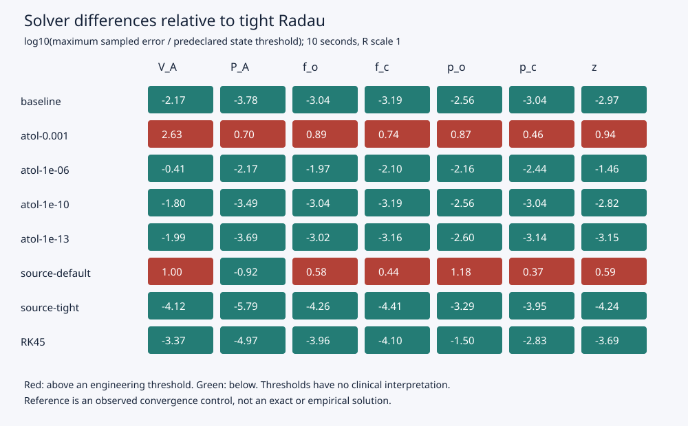

# Solver error and local resistance sensitivity in an unchanged respiratory software exposure

**Status:** reproducible numerical research draft, 8 September 2026. No human interpretation review, empirical validation, novelty or therapeutic claim. Investigator model: GPT-6 Astra, verified in the active runtime metadata.

## Abstract

We used the frozen Vital Rehearsal investigation distribution for 18 sequential, predeclared integrations of the exact Ben-Tal 2006 CellML combination exposure over 10 seconds. High-accuracy Radau, BDF and DOP853 agreed within 1.63×10⁻⁸ mmHg for every pressure state and within 1.55×10⁻¹⁰ litre for volume across three resistance settings. Changing the exposed mechanics resistance by ±10% produced maximum volume changes of 0.05248 and 0.04776 litre, at least seven orders of magnitude above the observed combined numerical envelopes. The source-default VODE comparator differed from tight Radau by 0.001507 mmHg in p_o; its disagreement fell to 5.10×10⁻⁸ mmHg when tightened. Scalar absolute tolerances matter for the small z state, but their scaling formula alone substantially overpredicts observed trajectory differences. These findings separate local equation sensitivity from numerical artifacts in this software exposure; they do not establish physiological fidelity.

## Source and methods

The target is [the exact CellML exposure](https://models.physiomeproject.org/exposure/b503501533abcf0e70786789f08cb902/bental_2006.cellml/view), revision 2e0e7ccc682bbf326829b3d78e3137ebdf8dbca0, with generated source SHA-256 `080d7472e2e162a6c76d1a9486601d9007ab11cfb28e964be8195b0d1e93947c`. Its documentation explicitly describes a combination of equations rather than one model in [Ben-Tal's paper](https://doi.org/10.1016/j.jtbi.2005.06.005). The article was not obtained and no article figure is reproduced. Equations and initial states remain unchanged. R scale 0.9–1.1 is the platform's admitted numerical neighbourhood, without physiological population interpretation.

The [frozen protocol](protocol.md) preceded every confirmation run; its hash is in [campaign metadata](confirmation-20260908/campaign.json). All 18 planned runs succeeded. Each used the actual packaged CLI, a sequential single worker, a 60-second timeout, and 2001 uniform output samples including both endpoints. Nine primary controls used Radau/BDF/DOP853 at each resistance setting, rtol=10⁻¹¹, atol=10⁻¹³ and maximum step 0.01 s. A Radau 0.005 s refinement tested the baseline. Remaining runs tested baseline settings, scalar atol changes, RK45 and two VODE settings. Source-default VODE was retained as an algorithmic comparator, never treated as exact truth.

[SciPy's versioned documentation](https://docs.scipy.org/doc/scipy-1.15.3/reference/generated/scipy.integrate.solve_ivp.html) describes distinct implicit Radau and multistep BDF methods, explicit DOP853, and local error scaling by atol+rtol×|y|. We compare their outputs using separate CSV-only analysis. The pointwise range across tight algorithms defines an observed numerical envelope. Its maximum width and the refinement difference must pass prespecified state thresholds before we classify parameter effects; the effect must also exceed ten times the sum of baseline and perturbed envelope widths. These are engineering thresholds, not clinical criteria or rigorous global error bounds. No random sample, p-value or confidence interval is appropriate.

## Results

All seven states passed the convergence criteria. The largest tight-algorithm envelope across R settings was 1.55×10⁻¹⁰ litre for V_A, 2.96×10⁻¹⁰ mmHg for P_A, 1.63×10⁻⁸ mmHg for p_o, 6.96×10⁻⁹ mmHg for p_c, 8.28×10⁻¹² for f_o, 5.93×10⁻¹² for f_c and 7.99×10⁻¹³ for z. The Radau step refinement differed by no more than 6.34×10⁻¹¹ mmHg in any pressure state. Full thresholds and results are in [convergence.csv](confirmation-20260908/convergence.csv).

| State (source unit) | Maximum change, R×0.9 | Maximum change, R×1.1 | Final signed change, R×0.9 / R×1.1 |
|---|---:|---:|---:|
| V_A (litre) | 0.0524807 | 0.0477650 | −0.00318910 / +0.00377669 |
| P_A (mmHg) | 0.269523 | 0.268491 | +0.269521 / −0.268472 |
| p_o (mmHg) | 0.465555 | 0.444423 | +0.0591981 / −0.0590050 |
| p_c (mmHg) | 0.195471 | 0.187570 | −0.0116281 / +0.0116146 |
| f_o (dimensionless) | 0.000613189 | 0.000585492 | +0.00000368343 / −0.00000373288 |
| f_c (dimensionless) | 0.000436104 | 0.000416365 | −0.00000290582 / +0.00000293984 |
| z (source label unresolved) | 0.0000635494 | 0.0000624580 | −0.0000150595 / +0.0000150218 |

Every maximum response exceeded the combined control width by at least 1.35×10⁷. This quantifies numerical separation only; shared equations can share structural mistakes. Maximum and final effects differ substantially, so endpoint-only reporting would conceal transient sensitivity. [Full effects](confirmation-20260908/resistance-effects.csv) preserve units, widths and ratios.

At the baseline R, source-default VODE differed from tight Radau by 1.00×10⁻⁵ litre in V_A and 0.001507 mmHg in p_o. Tightening VODE reduced these to 7.61×10⁻¹¹ litre and 5.10×10⁻⁸ mmHg. Baseline Radau differed by 6.69×10⁻⁹ litre and 2.78×10⁻⁷ mmHg respectively. Thus disagreement against the fixed source-default comparator is predominantly comparator tolerance error here, rather than evidence that the tighter Radau is less accurate.

The initial z is 4.4219×10⁻⁷ in unresolved source-labelled units. Even baseline atol=10⁻¹⁰ exceeds rtol×|z₀| by 22,615; the allowed scalar minimum of 10⁻¹³ still exceeds it by 22.6 at rtol=10⁻⁸. Nevertheless baseline maximum sampled z disagreement was only 1.07×10⁻¹¹. With fixed rtol=10⁻⁸ and maximum step 1 s, changing atol from 10⁻³ to 10⁻¹³ reduced maximum z disagreement from 8.69×10⁻⁸ to 7.16×10⁻¹². The largest relative z discrepancy for the loose case was 2.10×10⁻⁵ (0.00210%), excluding the common initial point. The scalar scaling issue therefore motivates measurement, but does not itself prove large realized error. Tight relative control of other components may constrain the common integration steps. The exposed CLI cannot test component-specific atol, so that proposed remedy remains untested. See [z-tolerance.csv](confirmation-20260908/z-tolerance.csv) and [all solver errors](confirmation-20260908/solver-errors.csv).

## Reproducibility, costs and limitations

The frozen build SHA-256 is `bc4043aa8c99b16354dd08aaf595c09a65a7b070be981ba435ba4c41210b2db2`. The retained run metadata identifies CPython 3.12.14, NumPy 2.2.6, SciPy 1.15.3 and Linux x86_64. All candidate integrations together consumed 6.414 seconds of measured wall time; platform-reported attempt totals summed to 21.731 seconds, including reference work and overhead. CLI elapsed times are retained separately; these are single-run measurements, not a performance distribution. Every trajectory, reference, diagnostic, source archive, sealed specification, stdout/stderr and runtime record is retained in the [inventory](confirmation-20260908/inventory.json), with [checksums](confirmation-20260908/sha256.json).

The numerical envelope is empirical algorithm disagreement, not an upper bound on truth error. All algorithms share equations, state definitions, floating-point libraries and host. Uniform 0.005-second output spacing may miss between-sample maxima and very early small-z transients. Scalar tolerances mix unlike units. Source unit ambiguities and the admitted pleural-pressure derivative inconsistency remain untouched. The 10-second, single-initial-state neighbourhood cannot support longer-horizon, population, physiological validity or patient-outcome claims. Artifact separation is a workflow convention rather than adversarial isolation. Qualified human review and external reproduction remain pending.

From the project directory, rerun with `.venv/bin/python research/robustness/study.py --campaign YOUR_NEW_NAME`, then `.venv/bin/python research/robustness/analyze.py YOUR_NEW_NAME`. The runner refuses an existing campaign directory. It invokes the distribution rather than importing the model; analysis does not simulate. Retain original confirmation evidence when repeating.
