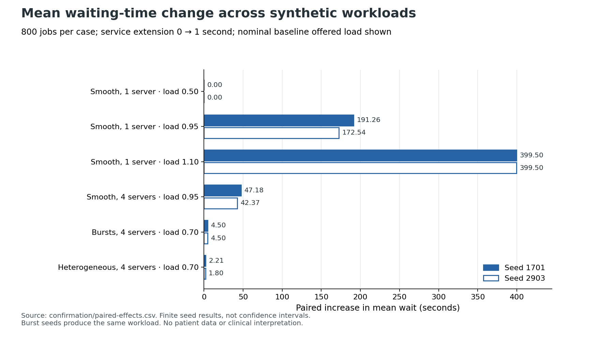

# Finite service-delay amplification in synthetic FCFS queues

Reviewed publication copy, 2026-09-08. [Separate automated reproduction](../review/review.md) accepted this bounded local draft. [Offline installation and first-run guide](../../docs/v1/FIRST_RUN.md). Original manuscript, frozen protocol, scripts and confirmation outputs remain unchanged. Human-qualified review and external human reproduction are pending.

**Engineering research manuscript · 8 September 2026 · local draft, interpretation review pending**

## Abstract

A one-second extension to each of 800 synthetic services produced mean waiting increases ranging from zero to 399.5 seconds across six prespecified workload scenarios. In a single-server case whose nominal offered load changed from 0.95 to 1.045, mean waiting increased by 172.543–191.261 seconds across two fixed seeds. With four servers at the same nominal load, the increase was 42.366–47.183 seconds; this comparison scales the arrival rate with capacity and is not an intervention adding servers to an unchanged stream. At nominal load 0.70, batches of 40 already produced 45 seconds of baseline mean waiting, illustrating information lost by a load-only summary. All 28 packaged-platform runs agreed with an independently coded workload-vector recurrence and accounting checks. These are exact finite synthetic engineering examples, not estimates of clinical effects or steady-state queue distributions.

## Research question and contribution

The software exposes a fixed, nonpreemptive first-come-first-served process model. The study asks when a constant service extension is absorbed by idle capacity versus accumulated into waiting. Its contribution is a reproducible quantitative benchmark of the delivered package, with explicit finite workload controls, artifact integrity checks and a documented server-assignment subtlety. Queue accumulation is established mathematics; no theoretical novelty is claimed.

Lindley’s original paper develops single-server waiting-time theory without requiring random arrivals. Its publisher abstract supports the historical framing; this study does not claim access to or reproduce the full paper’s derivations. [Lindley (1952), *The theory of queues with a single server*](https://doi.org/10.1017/S0305004100027638).

## Frozen methods and provenance

The protocol and executable analysis were hashed before any confirmation run. They remain unchanged: protocol SHA256 `7e424ee1fab8190f60b2e858b9287089dbf9b97e42f8669305f847990d4292be`; study SHA256 `30e3c170e86052b0f968d7d655418849137766e0f537a79e6b4f744fc099df73`. The exact tested distribution is `dist/vital-rehearsal-1.0.0rc1-investigation.pyz`, SHA256 `bc4043aa8c99b16354dd08aaf595c09a65a7b070be981ba435ba4c41210b2db2`. Every retained source archive reports that same build hash. Worker runtime was CPython 3.12.14, NumPy 2.2.6, SciPy 1.15.3, Linux x86_64 with glibc 2.28. The investigator’s session runtime identified GPT-6 Astra; it operated the CLI rather than importing the implementation into the analysis.

All jobs are original synthetic inputs under repository AGPL-3.0-or-later. The driver first requested the platform example, edited each draft, sealed it, ran it into a new attempt directory, then invoked platform inspection. It retained stdout, stderr, return codes and timings for every command. No source changes, clinical data, external publication or paid resources were used. Figure rendering and manuscript formatting were performed after confirmation and do not modify the frozen analysis.

Each main scenario contains 800 jobs, seeds 1701 and 2903, paired at delays 0 and 1 second. `low`, `near`, `over` have one server and nominal baseline offered loads 0.50, 0.95, 1.10. `multi` has four servers and load 0.95. These smooth cases have normalized uniform services around 10 seconds and normalized uniform interarrival gaps around the nominal interval. `burst` has four servers, 40 simultaneous 10-second jobs per batch, and batch spacing 142.857 seconds (load 0.70). `hetero` has four servers, shuffled services consisting of 640 jobs of 2 seconds and 160 of 42 seconds, regular gaps 3.57143 seconds (load 0.70). Burst seeds change input-list serialization but not the sorted workload; they are not independent replication. The protocol includes the exact generation rules.

All queues start empty at time zero. Makespan is maximum finish time; mean and nearest-rank p95 waiting include every job, with no warmup exclusion. Nominal load is average service divided by server count times nominal mean gap, with batch-rate convention for bursts. Finite realized utilization instead equals total busy work divided by server count times makespan; the two differ because observation includes draining. Baseline realized utilization was approximately 0.500 for `low`, 0.950 for `near`, 1.000 for `over`, 0.946–0.947 for `multi`, 0.711 for `burst`, and 0.694–0.700 for `hetero`.

The primary endpoints are paired changes in mean waiting and makespan. All 12 pairs and all secondary endpoints were retained. The run budget was 28 planned calls with an absolute ceiling of 32 for documented mechanical recovery, maximum 2,000 jobs per call, a 60-second worker timeout and a 15-minute campaign deadline. Exactly 28 calls were used; no mechanical recovery or endpoint-driven additional runs occurred.

## Independent checks

The checker subtracts each interarrival interval from a sorted vector of remaining workloads, truncates at zero, assigns the next service to the smallest workload, then sorts again. This representation does not use the platform’s heap. The smallest preassignment workload gives waiting; arrival plus waiting gives start, and service plus delay gives completion. Single-server cases additionally use the finite recurrence

`W[0] = 0; W[n] = max(0, W[n-1] + S[n-1] + delay - (A[n]-A[n-1]))`.

This recurrence follows directly from unfinished prior service; it is stated here as the explicit checking algorithm. Server identity is checked separately by scanning prior finish histories and choosing the earliest finish, then lowest id on equal finish. This identity check shares the specification’s rule; agreement is not evidence of independent scientific model validity.

Every run checks ordered job ids, count, nonnegative waiting, absence of per-server overlap, completion minus start equalling service plus delay, and agreement of recomputed summaries with platform JSON. Integrating the queue-depth event sequence must equal the sum of individual waits (job-seconds). Numeric comparison uses 1e-8 seconds absolute plus 1e-12 relative tolerance. CSV is serialized and parsed again without field changes. Each platform bundle passed `research inspect`; manifest consistency establishes integrity relative to the manifest, not authenticity.

## Results

| Scenario | Seed | Baseline mean wait (s) | Delayed mean wait (s) | Δ mean (s) | Δ p95 (s) | Δ makespan (s) |
|---|---:|---:|---:|---:|---:|---:|
| low | 1701 | 0.000 | 0.000 | 0.000 | 0.000 | 1.000 |
| low | 2903 | 0.000 | 0.000 | 0.000 | 0.000 | 1.000 |
| near | 1701 | 1.640 | 192.901 | 191.261 | 367.428 | 380.171 |
| near | 2903 | 1.449 | 173.992 | 172.543 | 344.315 | 378.063 |
| over | 1701 | 367.415 | 766.915 | 399.500 | 758.942 | 800.000 |
| over | 2903 | 348.330 | 747.830 | 399.500 | 759.000 | 800.000 |
| multi | 1701 | 0.640 | 47.823 | 47.183 | 90.511 | 95.092 |
| multi | 2903 | 0.538 | 42.905 | 42.366 | 84.341 | 95.490 |
| burst | 1701 | 45.000 | 49.500 | 4.500 | 9.000 | 10.000 |
| burst | 2903 | 45.000 | 49.500 | 4.500 | 9.000 | 10.000 |
| hetero | 1701 | 4.353 | 6.560 | 2.208 | 7.857 | 14.714 |
| hetero | 2903 | 3.544 | 5.348 | 1.803 | 9.571 | 1.000 |




The near-capacity single-server examples cross nominal capacity when services increase from average 10 to 11 seconds. Their mean waiting rises from 1.449–1.640 seconds to 173.992–192.901 seconds. Because the baseline and delayed samples use exactly the same arrivals and services, the difference is attributable to the service extension within this deterministic model. The seed range describes those two inputs only.

In the overloaded single-server cases the server stays busy throughout. A one-second extension adds exactly the job index to waiting, so the mean increment is `(800-1)/2 = 399.5` seconds, the maximum increment is 799 seconds, and completion increases by 800 seconds. The observed values match these finite accounting predictions to floating-point tolerance. This gives a mechanistic explanation for the largest effect rather than relying only on an opaque simulation comparison.

For `burst`, each batch consists of ten waves of four simultaneous jobs. Mean waiting is `10*(0+...+9)/10 = 45` seconds; with 11-second services it is 49.5 seconds. Each batch drains before the next, so the mean effect remains 4.5 seconds rather than growing across batches. The 0.70 nominal load therefore coexists with substantial waiting caused by timing concentration. The heterogeneous examples at the same nominal load have baseline means 3.544–4.353 seconds and increments 1.803–2.208 seconds; this is a descriptive comparison of two different input designs, not an isolated estimate of the causal effect of variability.

The four-server near-capacity scenario has smaller accumulation than its single-server counterpart. Arrival rate was also scaled fourfold and the job count held at 800, shortening the arrival horizon. The result cannot be presented as the benefit of deploying four servers to the identical workload. Similarly, the absence of waiting in `low` is a property of these bounded services and gaps, not a universal guarantee at load 0.50.

## Held-out semantics and rejection behavior

Four held-out runs passed: reversed input list reproduced a main-case `schedule.csv` byte for byte; 32 simultaneous jobs on 16 servers obeyed ASCII order and equal-finish tie rules; a one-server case exercised service bounds 0.001 and 10000 seconds, arrival 1,000,000 seconds and delay100; an idle-gap example exercised case-sensitive ids and server selection.

The last case makes a documentation detail concrete. At time zero job `A` receives server0 for 2 seconds, while job `a` receives server1 for 1 second. At time10 both are idle, but `later` receives server1 because its previous completion time1 precedes server0’s time2. Thus “lowest server id wins ties” in rc1 means ties in prior availability timestamps, not any collection of currently idle servers. This does not alter waiting or makespan for identical servers here, but it matters to reproducibility of server labels and any downstream per-server reporting. The parent maintainer was informed before interpreting the evidence; the frozen build was preserved.

Duplicate ids and a non-ASCII id were rejected at sealing. Changing the delay in an already sealed specification was rejected at validation. These three expected rejections remain in the 88-command inventory; there were no unexpected failures or excluded completed runs. Small held-out cases supplement, rather than exhaust, the supported domain: 10,000 jobs, all server counts, every accepted id form and every extreme combination were not tested.

## Cost, artifacts and reproducibility

Measured driver wall time was 21.461 seconds, summed CLI run wall time 10.921 seconds, and summed platform-reported worker lifecycle wall time 3.546 seconds. Those are nested timings and must not be added. The stored worker timing includes subprocess management and waiting, not isolated scheduling CPU time. Evidence occupied 14,060,885 bytes at the end-of-analysis measurement before final cost/figure/manuscript files. CPU-seconds, peak memory and financial cost were not instrumented; no paid resources were requested. These host-specific startup-dominated measurements are not throughput benchmarks.

`confirmation/all-attempts.json` is the complete command-level inventory, including rejection outcomes. `confirmation/results.json` and `summary.csv` retain every run with relative bundle paths, computed metrics, size and timings. `paired-effects.csv` contains the exact paired table. Each bundle contains the sealed study, schedule, result, runtime, report, license notices, frozen source and manifest. `FROZEN.sha256` identifies the preconfirmation files. `figure-1.svg` and `.png` are the manuscript plots; the original driver-generated SVG remains an ancillary artifact. `plot.py` and `write_manuscript.py` are postconfirmation formatting tools.

From the repository’s `vital-rehearsal` directory, rerun without overwriting original evidence:

```sh
.venv/bin/python research/scheduling/study.py --output research/scheduling/reproduction
```

The output directory must not exist. The driver accepts `--platform` and `--python` paths. For reproduction after a package rebuild, explicitly pass a retained `confirmation/attempts/<attempt-id>/source.pyz` whose hash is the tested rc1 hash above. No claim is made that later package versions are verified by this evidence. `plot.py` uses the supplied confirmation data and installed Matplotlib (version recorded in `plot-runtime.json`); the main driver uses only Python’s standard library beyond the platform runtime dependencies.

## Limitations and interpretation boundary

There is no scientifically reviewed typed event mapping from this scheduler to the separate respiratory exposure. `synthetic.service_completed.v1` is a software event label only. No patient outcome, treatment delay, safety, staffing recommendation or physiology coupling follows from these results. Server homogeneity, unlimited queue capacity, fixed job services, no preemption, no abandonment and no feedback are structural assumptions.

The observations concern finite transient queues starting empty. They are not steady-state estimates. Two chosen seeds are insufficient for inferential intervals or tail-risk estimates; burst seeds duplicate one workload. Sample normalization constrains averages and changes the relation to unconditioned random draws. The comparator and invariants share mathematical assumptions and can share conceptual errors. The same-host investigator and package are not adversarially isolated, and neither hashes nor an AI-generated manuscript establish qualified scientific review. Human interpretation review, external reproduction, public release and publication remain pending.

The supported engineering finding is limited but substantive: for these declared finite queues, a constant per-job service increment can be absorbed completely by idle time, accumulate approximately linearly across a busy horizon, or produce bounded within-batch increases. Reporting nominal load alone omits the timing and service structure needed to distinguish those regimes.
